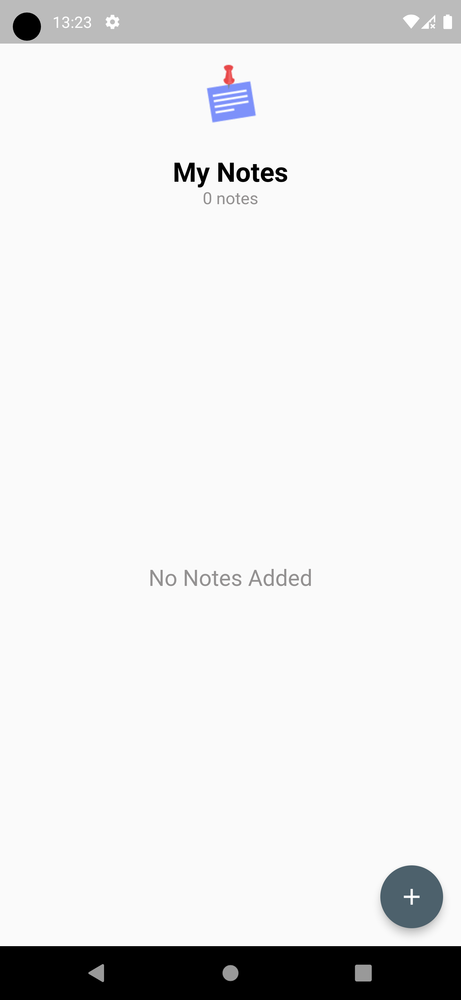
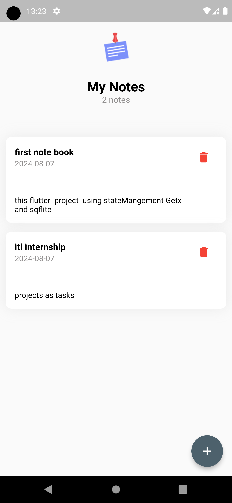
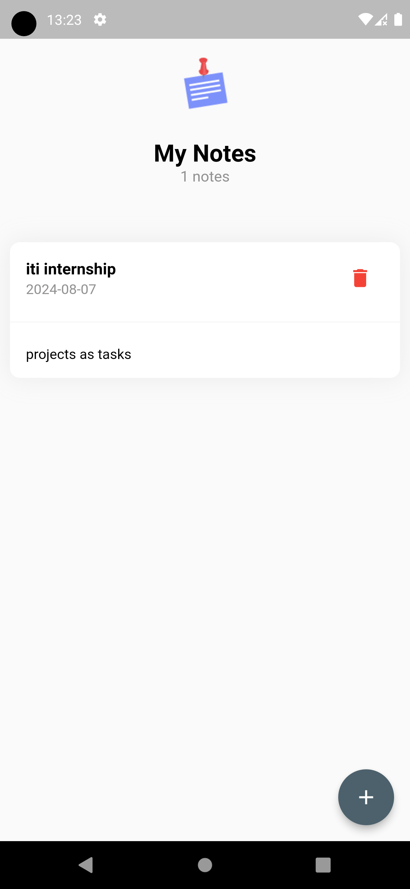
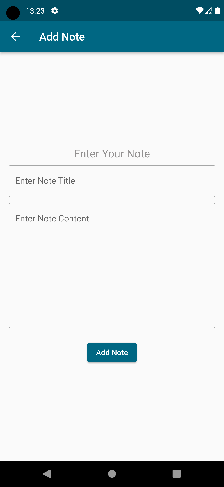

# Note App

## Getting Started

This project is a starting point for a Flutter application. It is a simple note-taking app that allows users to add, view, and delete notes.

## Features

- Add Notes: Create new notes with titles and content.
- View Notes: Browse through a list of saved notes.
- Delete Notes: Remove notes from the list.
- Persistent Storage: Notes are saved locally using SQFlite.

## Screen shots

- Home Screen

- Add Note screen

